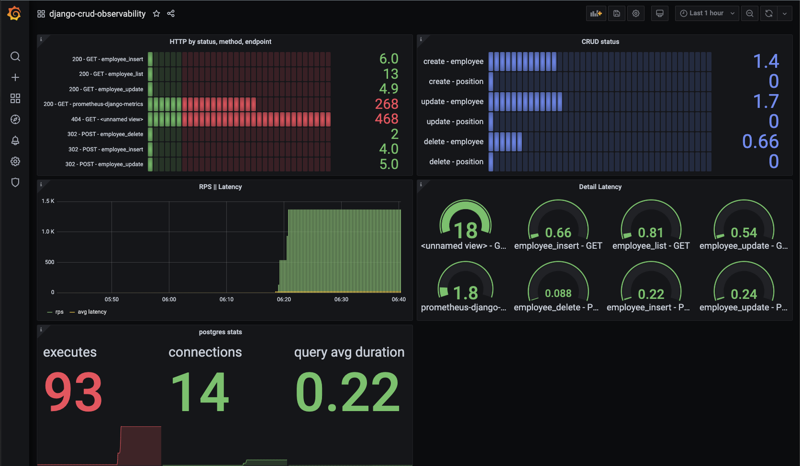

# Overview

Django & observability (Grafana + Prometheus).

**requirements**

|tool          |tested versions                                              |
|--------------|-------------------------------------------------------------|
|docker        |`Docker version 20.10.8, build 3967b7d`                      |
|docker-compose|`docker-compose version 1.29.2, build 5becea4c`              |
|make          |`GNU Make 3.81`                                              |
|bash          |`GNU bash, version 3.2.57(1)-release (x86_64-apple-darwin20)`|
|jsonnet       |`Jsonnet commandline interpreter v0.17.0`                    |

1. Launch application and services, create db tables.
```shell
docker-compose up -d
make 
```
| Service      | Endpoint                       | Auth        |
|--------------|--------------------------------|-------------|
| django-app   | http://localhost:8000/employee | -           |
| django-admin | http://localhost:8000/admin    | admin:1234  |
| prometheus   | http://localhost:9090/         | -           |
| grafana      | http://localhost:3000/         | admin:admin |

Open app url, and create some people, do some mess.

2. Grafana

I suggest to take a look on grafana tutorials, for example [Grafana fundamentals](https://grafana.com/tutorials/grafana-fundamentals/).

Add DS(data source) in our case - prometheus. `Configuration` -> `Add data source` -> `Prometheus`. In url paste `http://prometheus:9090` and click `Save & test`.

Upload dashboards `+` -> `import` and select json file from `./app/utils/grafana/grafana.json` or feel free to change something in jsonnet and regerate it via `make generate_dashboard`. Save dashboard.

---

You should see something like the fallowing image:



# Roadmap

- grafana / time series database persistence
- improve grafana dashboards jsonnet templates
- load testing / benchmark (http/models)
- minikube deployment
- logs
- custom metrics
